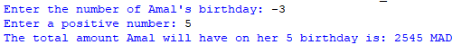

## Description 
This program calculates the total amount Amal will have in her savings account on her nth birthday, with her grandfather depositing 500 MAD on each birthday, and adding three times her age to the account.
## Example 

